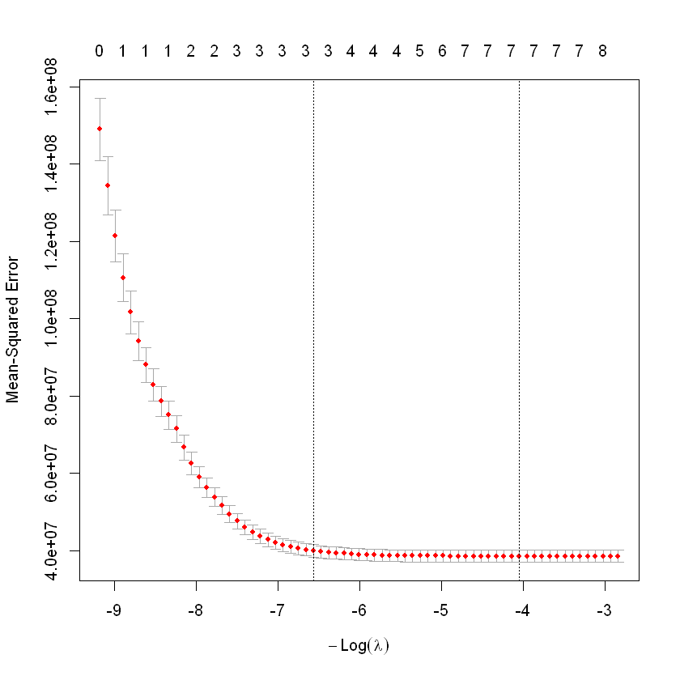
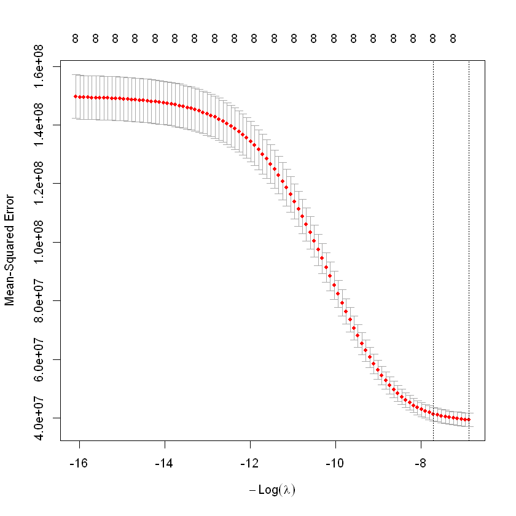

# 🩺 Regressão Regularizada para Previsão do Custo do Seguro Saúde (R/MLOps)

## 🎯 Objetivo do Projeto

Este projeto demonstra a aplicação de modelos de **Regressão Linear Regularizada (Ridge e Lasso)** usando R para construir um modelo estável e interpretável capaz de prever os custos anuais de seguro saúde (`charges`) com base em características demográficas e de saúde dos segurados (idade, BMI, fumante, etc.).

O principal foco é encontrar o melhor ponto de equilíbrio no **Trade-off Viés-Variância** e utilizar a **Regressão Lasso** para realizar a **Seleção Automática de Variáveis**, simplificando o modelo final.

## 🔑 Conceitos Fundamentais Abordados

* **Regressão Lasso (L1):** Aplica uma penalidade de valor absoluto ($\lambda \sum |\beta_j|$) que **zera** os coeficientes das variáveis irrelevantes, promovendo a parcimônia.
* **Regressão Ridge (L2):** Aplica uma penalidade de quadrado ($\lambda \sum \beta_j^2$) que **encolhe** todos os coeficientes em direção a zero, aumentando a estabilidade do modelo.
* **Validação Cruzada (CV):** Utilizada com o pacote `glmnet` para otimizar o hiperparâmetro **Lambda ($\lambda$)** e encontrar o melhor modelo generalizável.

## ⚙️ Estrutura do Repositório

* `insurance.csv`: Dataset de entrada original.
* `assets/`: Contém os gráficos de Validação Cruzada dos modelos.
    * `lasso_cv_path.png`
    * `ridge_cv_path.png`
* `01_Model_Regularization.ipynb`: Notebook principal em R com as etapas de pré-processamento, treinamento e avaliação.

## 🛠️ Tecnologias Utilizadas

* **Linguagem:** R
* **Ambiente:** VS Code / Jupyter Notebook
* **Pacotes Principais:** `glmnet`, `caret`, `readr`, `Matrix`

---

## 📊 Resultado Esperado

O resultado é um modelo paramétrico que não apenas prevê o custo do seguro com alta precisão (baixo **RMSE**), mas também oferece alta **interpretabilidade**, permitindo que a seguradora entenda exatamente o impacto de cada fator de risco (como ser fumante ou ter alto BMI) na estrutura de custos.

## 📊 Resultados obtido e Análise

O projeto utilizou 10-fold Cross-Validation para otimizar os modelos e o **RMSE** (Root Mean Squared Error) no *set* de teste para comparação de desempenho.

### I. Otimização e Seleção de Variáveis (Lasso)

O Lasso encontrou o $\lambda$ ótimo ($57.47$) e realizou a seleção de variáveis:

* **Lambda Ótimo:** $57.46561$
* **Seleção:** O coeficiente da variável `regionnorthwest` foi **zerado** ($\mathbf{.}$), indicando que esta *feature* não contribui significativamente para o modelo de custo no nível de penalidade ideal.

| Variável | Coeficiente no $\lambda$ Ótimo |
| :--- | :--- |
| (Intercept) | -11440.6780 |
| age | 255.1052 |
| smokeryes | **23800.9871** |
| regionnorthwest | **.** (Zerado) |

**Gráfico do Caminho dos Coeficientes Lasso:**

### II. Otimização Ridge (Estabilidade)

O Ridge encontrou um $\lambda$ ótimo mais alto ($958.58$) e encolheu todos os coeficientes, mas manteve todos eles diferentes de zero.

* **Lambda Ótimo:** $958.5842$

**Gráfico do Caminho dos Coeficientes Ridge:**

### III. Comparação Final de Desempenho (RMSE)

| Modelo | RMSE no Set de Teste | Conclusão |
| :--- | :--- | :--- |
| **Lasso ($\alpha=1$)** | **5763.20 R\$** | Melhor Desempenho e Mais Interpretabilidade. |
| **Ridge ($\alpha=0$)** | 5792.96 R\$ | RMSE marginalmente superior. |

### Conclusão do Projeto

O **Modelo Lasso** foi o escolhido por oferecer a **melhor acurácia de previsão (menor RMSE)** e, simultaneamente, o benefício de **interpretabilidade** ao identificar e eliminar preditores menos relevantes (`regionnorthwest`). O erro médio de previsão no custo do seguro é de aproximadamente **R$ 5.763,20**.